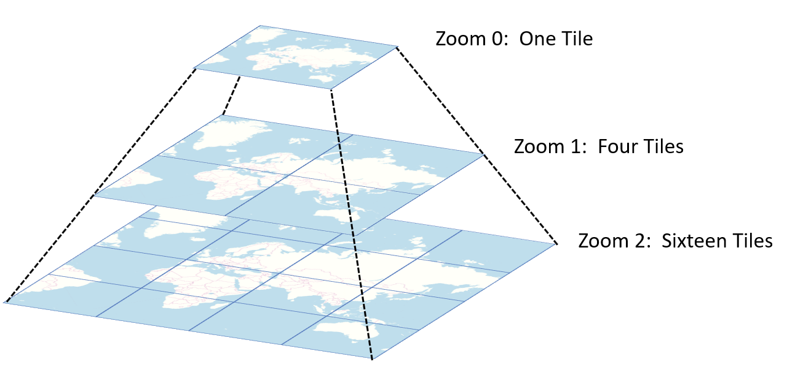
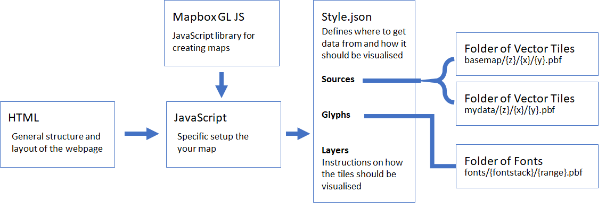

# Making Vector Tiles: For Pleasure and Profit

By 

Dr Malcolm Morgan, Research Fellow in Transport and Spatial Analysis, Institute for Transport Studies, University of Leeds

Dr Layik Hama, Leeds Institute for Data Analytics, University of Leeds


## Summary
Vector Tiles are a great new way to serve geographic data via web maps.  They provide significant improvements over traditional methods of creating web maps but are a little more complicated to set up. 

This tutorial explains how to use Vector Tiles for both base maps but more importantly, how to create your own vector tile layers.  It also explains how to do this using comply free software and avoiding licencing or subscription fees. 

In this tutorial, we will cover going from a source geographic file format to viewing tiles on your website using Mapbox GL JS. To achieve this, we will only use free open source tools provided by Mapbox and others. The documentation, we feel requires some improvement for someone to accomplish this, hence this blog post.

## Introduction
Web maps (Haklay et al. 2008) are a great way to present your data; they allow for interactivity, and for users to zoom into their area of interest. But they have a problem with large datasets; they become slow and unresponsive. This decline in performance is because you must download all your data before it is put onto the map. The solution was to tile the data.

### Tiling – What it is and why it matters
Tiling breaks your data into many small square datasets (tiles) than can then be downloaded individually. This means that you only have to download the tiles in the area you interested in rather than the whole dataset. This both reduces the amount of data that the webserver has to send to the user and reduces the amount of data the user’s computer must hold in memory.
Tiling was first implemented for raster data with each tile being a 256 x 256 pixel PNG image. It works well for basemaps and is still used by many websites today such as https://www.openstreetmap.org/. Tiles exist in a pyramid structure; at the top of the pyramid (zoom level 0), the whole world is a single tile. Each step down the pyramid (zoom levels 1,2,3 etc.) increases the number of tiles by a factor of 4.  Tilesets typically go down to about zoom level 19 at which point one tile covers an area about the size of a single building.



Raster tiles have two significant limitations:
1. They are static – you can’t click on an image to get extra information or dynamically change the styling of the map.
2. They are large – while each tile is small, hosting all the tiles uses up a lot of space on your server. For example, a tileset for the UK is around 15 GB.

Due to these limitations raster tiles are mostly used for base maps and are served by third party services. 

### Introducing Vector Tiles
Vector Tiles are a newer take on the idea of tiling, instead of many images the tiles are lots of tiny vector datasets. These vector tiles are usually smaller, as not all pixels need to be coded.

## Prerequisites

Most of the tools in this tutorial are Linux command line applications. So you will need a Linux computer with permission to install the software. If you do not have a Linux computer, you can.

1. Create a virtual machine using software such as [Virtual Box](https://www.virtualbox.org/)
2. On Windows 10, use the [Windows Subsystem for Linux](https://docs.microsoft.com/en-us/windows/wsl/install-win10) 

### Required Software

**[tippecanoe](https://github.com/mapbox/tippecanoe)**

Tippecanoe is free software from Mapbox which converts `.geojson` files into vector tiles.

**[mbutils](https://github.com/mapbox/mbutil)**

Tippecanoe is free software from Mapbox which converts `.mbtiles` files into a folder of vector tiles.

**A text editor**

We will be editing some files and a simple text editor will be required.

**A HTML Server**

This tutorial was written with [Apache](https://httpd.apache.org/) in mind, but any modern HTML server will do.

**GIS Software**

You will need to project your dataset to `epsg:4326` and convert them into the `.geojson` format. This can be done in a wide range of free GIS software such a [QGIS](https://qgis.org/en/site/) 

## Part 1: Making Vector Titles

### To gzip or not to gzip

Berfor generating the vector tiles you must make a decison on if they will be gzipped or not. [gzip](https://en.wikipedia.org/wiki/Gzip) is a compression standard which is supported by all modern browsers. The compressed `.pbf` files are about 25% of the size of the uncompressed ones. This saves storage space on your server and speeds up the download of the tiles, giving your users a better experience.

So gzipped `.pbf` files are better. But to use the gzipped files, you must modify the [HTTP Headers](https://en.wikipedia.org/wiki/List_of_HTTP_header_fields) to include:

```
Content-Encoding: gzip
```

This will tell the user's browser that the files are gzipped and to ungzip them before trying to use them. Without this HTTP Header, the browser will be unable to read and render the tiles. So gzipping is only a good idea if you are able to modify the HTTP Headers on your server.

The sections below will outline how to generate tiles with and without gzipping and how to modify HTTP headers when using [Apache](https://httpd.apache.org/) server. If you are using a different server software, check for a tutorial on how to modify HTTP headers.


### Making a Basemap

To have a basemap, you have three main choices:

1. Get your basemap from a 3rd party service such as Mapbox, depending on your usage you may need to pay.
2. Get pre-made tiles from OpenMapTiles, free for non-profit uses but a $1000 fee for commercial projects
3. Generate your own tiles, free but most difficult.

#### Using OpenMapTiles

You can sign up for a free account at www.openmaptiles.com 

If you don't want to use gzipped `.pbf` files then you can generate uncompressed files with tippecanoe by:

```sh
tippecanoe -zg --output-to-directory=mytiles --drop-densest-as-needed --no-tile-compression msoa.geojson
```


#### Generating your own Basemap

### Making Tiles from your own Data

#### Converting your data to GeoJSON

The tools we use to create Vector Tiles require the input data to be in the `.geojson` format an to be using the `epsg:4326` coorinate reference system.

Converting a shapefile into tile:

An example file in question would be the UK MSOA boundaries which are roughly ~600M in size when converted to plain `.geojson` file.

This could be achieved in R for instance:

```R
# get LAs
folder = "/tmp/Counties_and_UA"
if(!dir.exists(folder)) {
  dir.create(folder)
}
url = "https://opendata.arcgis.com/datasets/f341dcfd94284d58aba0a84daf2199e9_0.zip"
msoa_shape = list.files(folder, pattern = "shp")[1]
if(!file.exists(file.path(folder, msoa_shape))) {
  download.file(url, destfile = file.path(folder, "data.zip"))
  unzip(file.path(folder, "data.zip"), exdir = folder)
  msoa_shape = list.files(folder, pattern = "shp")[1]
}
library(sf)
msoa = st_read(file.path(folder, msoa_shape))
st_write(msoa, "~/Downloads/msoa.geojson")
```
We have not tested Python but there has to be [packages](https://pypi.org/project/pyshp/1.1.7/) that can read shapefiles and interpret them into GeoJSON. If you have GDAL [installed](https://tracker.debian.org/pkg/gdal) then oneline would achieve the same thing, if you already have downloaded the shapefile. So the above can be done as:

```sh
ogr2ogr -f GeoJSON msoa.geojson /tmp/Counties_and_UA/Counties_and_Unitary_Authorities_December_2017_Full_Extent_Boundaries_in_UK_WGS84.shp -lco RFC7946=YES

```

#### Converting GeoJSON to Vector Tiles

##### Converting to a single mbtiles file


##### Converting to a folder of PFB files


Let us convert this to a format called `.mbtiles` which is essentially an SQLite zipped formatted the way Mapbox (hence the mb part) can read it.

We will use [`tippecanoe`](https://github.com/mapbox/tippecanoe) repo/package to achieve this.

```sh
tippecanoe -zg -o out.mbtiles --drop-densest-as-needed msoa.geojson
```

//TODO use the mbtile viewer to view the tiles we generated.

We [can now serve](mapbox.mapbox-streets-v8) the `.mbtiles` in a Mapbox JS instance. The drawback here, is an initial lag in downloading the whole file by the client (browser), the pro is, as you probably guess, is this happens only once. It was perhaps developed for mobile apps and works perfectly for such cases.

//TODO add html example with mbtiles
//TODO test servers and CORS

However, not everyone can do this as the size of the package could be large and slower connection clients would be punished harshly. It is important to shorten the ["time to first byte"](https://en.wikipedia.org/wiki/Time_to_first_byte). That is why we should consider unzipping the package into single `pbf` tiles. Protocol buffers (pbf) is a language neutral [serialaization](https://developers.google.com/protocol-buffers) by Google.

We can do this by:

## Part 2: Hosting Vector Tiles

then the HTTP header can be simply modified by adding a `.htaccess` file into the folder containing all your tiles.

```
Header set Content-Encoding: gzip
```


When hosting vector tiles on your own server, you have to main choices:

1. Install a specialist tile hosting server such as TileServer and use a `.mbtiles`
2. Generate individual `.pbf` tiles and then upload them to a folder on your server.

### Hosting a folder of individual titles

This method is very simple and does not require the installation of specialist software on your server. This means you can even host the tiles on file of servers such as Amazon S3. It shoudl also improvement the hosting performance as your serve does not need to do any processing, simply serve the requested files. The downside is that you get no support or helpful features included in your chosen software.

You can convert a `.geojson` file into a folder of vector titles via the following command

```sh
tippecanoe -zg --output-to-directory=mytiles --drop-densest-as-needed msoa.geojson
```
This will create a folder called `mytiles` containing many subfolders with all of your tiles.


#### Uploading your tiles

Once you have created your tiles simply upload them to your server using an FTP client such as [Filezilla](https://filezilla-project.org/)


### Hosting using a mbtiles file

See documentation at https://openmaptiles.org/docs/

## Part 3: Visualising Vector Tiles
There are many ways to view vector tiles, but when building a website, we recommend using Mapbox GL JS. Mapbox GL JS is a Javascript library which takes advantage of [WebGL](https://en.wikipedia.org/wiki/WebGL) this means the library can use both the GPU and the CPU to render your maps rather than just the CPU as was the case with older libraries such as [leaflet](). The use of the GPU means that you can render larger and more complex datasets such as 3D maps, animations, and other advanced features.

Although Mapbox GL JS is open source, it is maintained by Mapbox and most of the documentation steers you towards using Mapbox's paid services. However, it works equally well with vector tiles hosted from any location. 

Mapbox GL JS has good [documentation](https://docs.mapbox.com/mapbox-gl-js/api/) and lots of [examples](https://docs.mapbox.com/mapbox-gl-js/examples/) to this tutorial will focus on the changes required for hosting your own vector tiles and supporting multiple vector tile layers.


This example is based on the Mapbox getting started [example](https://docs.mapbox.com/mapbox-gl-js/example/simple-map/).

```html
<!DOCTYPE html>
<html>
<head>
<meta charset="utf-8" />
<title>Display a map</title>
<meta name="viewport" content="initial-scale=1,maximum-scale=1,user-scalable=no" />
<script src="https://api.mapbox.com/mapbox-gl-js/v1.9.0/mapbox-gl.js"></script>
<link href="https://api.mapbox.com/mapbox-gl-js/v1.9.0/mapbox-gl.css" rel="stylesheet" />
<style>
	body { margin: 0; padding: 0; }
	#map { position: absolute; top: 0; bottom: 0; width: 100%; }
</style>
</head>
<body>
<div id="map"></div>
<script>
    mapboxgl.accessToken = 'NotNeeded';
    var map = new mapboxgl.Map({
        container: 'map',                                 // container id
        style: 'https://www.mysite.com/tiles/style.json', // stylesheet location
        center: [-1, 53],                                 // starting position [lng, lat]
        zoom: 9                                           // starting zoom
    });
</script>

</body>
</html>
```
The key changes from the Mapbox example are; that `mapboxgl.accessToken` must be defined but is not used as we are not connecting to the Mapbox services, and the location of the `style.json` has been changed to a URL on your server. 

### Constructing the style.json file

You will notice that in the HTML example above, we made no reference to where our vector tiles are of how they should be displayed. This is because all this information is contained within a stylesheet `.json` file. The full specification for the stylesheet can be found [here](https://docs.mapbox.com/mapbox-gl-js/style-spec/), but a simplified structure is shown below.

```json
{
  "version": 8,
  "name": "Basic",
  "metadata": {
    "openmaptiles:version": "3.x"
  },
  "sources": {
    "openmaptiles": {
      "type": "vector",
      "tiles": ["https://www.mysite.com/tiles/basemap/{z}/{x}/{y}.pbf"]
    },
    "msoa": {
      "type": "vector",
      "tiles": ["https://www.mysite.com/tiles/msoa/{z}/{x}/{y}.pbf"
      ]
    }
  },
  "glyphs": "https://www.mysite.com/fonts/{fontstack}/{range}.pbf",
  "layers": [
    {
      "id": "background",
      "type": "background",
      "paint": {
        "background-color": "hsl(47, 26%, 88%)"
      }
    },
    {
      "id": "landuse-residential",
      "type": "fill",
      "source": "openmaptiles",
      "source-layer": "landuse",
      "filter": [
        "all",
        [
          "==",
          "$type",
          "Polygon"
        ],
        [
          "in",
          "class",
          "residential",
          "suburb",
          "neighbourhood"
        ]
      ],
      "layout": {
        "visibility": "visible"
      },
      "paint": {
        "fill-color": "hsl(47, 13%, 86%)",
        "fill-opacity": 0.7
      }
    },
    {
      "id": "msoa_layer",
      "type": "fill",
      "source": "msoa",
      "source-layer": "msoa",
      "layout": {
        "visibility": "visible"
      },
      "paint": {
        "fill-color": "hsl(105, 13%, 86%)",
        "fill-opacity": 0.7
      }
    }
  ],
  "id": "basic"
}

```


## References:
Haklay, Muki, Alex Singleton, and Chris Parker. "Web mapping 2.0: The neogeography of the GeoWeb." Geography Compass 2.6 (2008): 2011-2039.
